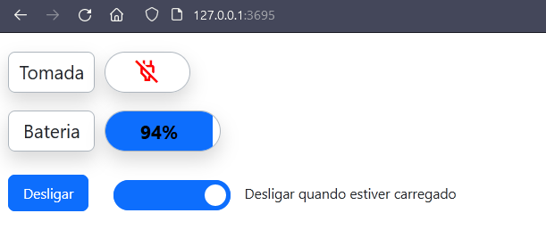
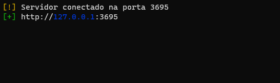

# Personal Server


 Sinta-se livre para usar esse `template` de servidor em `NodeJS` para o que você quiser.



> Visão web do servidor



> Console do servidor web.

## Exemplos de Aplicação

- Monitorar a batéria dos notebook de forma local, pelo seu celular.

## 🚀 Instalando

Para instalar o `personal_server` , siga estas etapas:

```
npm run
```

## ☕ Usando 


```
npm run dev
```


## 📫 Tecnologias 
<div id="container_imgs" style="display:flex">
  
  
  
  
</div>

## 📫 Bibliotecas

### [Nodemon](https://github.com/remy/nodemon)
### [EJS](https://github.com/mde/ejs)
### [SYSTEMINFORMATION](https://github.com/sebhildebrandt/systeminformation)

